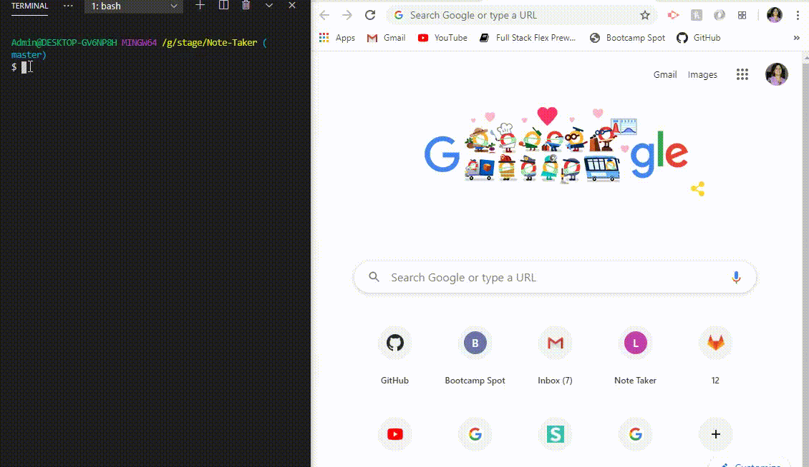

# Note-Taker


## Table of Contents
   * [Description](#description)
   * [Usage](#usage)
   * [Built with](#built-with)
   * [Installation](#installation)
   * [Badges](#badges)
   * [Contributing](#contributing)
   * [License](#license)
   * [Tests](#tests)
   * [Visuals](#visuals)

## Description

An application that can be used to write, save, and delete notes.

This application will use an express backend and save and retrieve note data from a JSON file.

The user will be able to write and save notes. The user will also be able to delete notes they have written before SO they can organize their thoughts and keep track of tasks that need to be completed.

## Badges
[](https://img.shields.io/github/followers/sujatha-m?style=social)
[](https://img.shields.io/website?url=https%3A%2F%2Fsujatha-m.github.io%2FWeather-Dashboard%2FDevelop%2F)


## Visuals



## Built with
* JavaScript
* NodeJS
* Node Packages:
* Express

## Installation 
Run npm install to install all dependencies. To use the application locally, run node server.js in your CLI, and then open http://localhost:3000 in your preferred browser. The Note Taker app is live on Heroku for you to use as well.

## Usage
```sh
      node server.js  
```

## Contributing
Pull requests are welcome. For major changes, please open an issue first to discuss what you would like to change.
Please make sure to update tests as appropriate.


## License 
[](https://img.shields.io/npm/l/isc?color=Blue&style=plastic)

## Questions
# 

jhanavi.bhushan@gmail.com